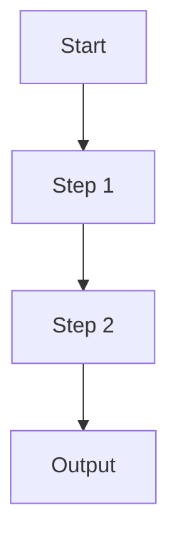

# Workflow Note - Workflow Name

## 1. 流程摘要

簡要說明此流程的目的、適用情境、輸入、輸出，以及在實習中的用途。

範例：

```text
此流程主要用於 ______，目的是 ______。流程開始於 ______，最後輸出 ______。
```

---

## 2. 流程基本資訊

| 項目 | 內容 |
|---|---|
| 流程名稱 |  |
| 流程類型 | 業務流程 / 技術流程 / Agent Workflow / ETL / 文件流程 / 開發流程 / 部署流程 / 其他 |
| 建立日期 | YYYY-MM-DD |
| 適用情境 |  |
| 輸入(Input) |  |
| 輸出(Output) |  |
| 相關 Daily Log | `logs/daily/YYYY-MM-DD.md` |
| 原始筆記來源 | `raw/imported_notes/YYYY/YYYY_MM_DD_Ddd.md` |

---

## 3. 流程背景

說明此流程是在什麼情境下建立或學到。

可包含：

- 主管要求
- 專案需求
- 工具操作
- 系統建置
- 自主整理

若涉及公司內部流程，請使用抽象化描述。

---

## 4. 流程目標

此流程希望解決哪些問題？

- [ ] 
- [ ] 
- [ ] 

---

## 5. 前置條件（Prerequisites）

開始流程前需要具備哪些條件？

| 項目 | 說明 |
|---|---|
| 必要工具 |  |
| 必要資料 |  |
| 必要權限 |  |
| 必要知識 |  |

若涉及公司內部權限，請勿記錄詳細權限資訊。

---

## 6. 流程步驟

| Step | 操作內容 | 使用工具 | 輸出 |
|---|---|---|---|
| 1 |  |  |  |
| 2 |  |  |  |
| 3 |  |  |  |
| 4 |  |  |  |

建議每一步都盡量可以獨立理解。

---

## 7. 流程圖（可選）

若流程較複雜，可補上 Mermaid。



---

## 8. 流程中的工具

| 工具 | 用途 | 相關筆記 |
|---|---|---|
|  |  | `wiki/tools/...` |

---

## 9. 流程中的資料

| 資料 | 用途 | 敏感性 |
|---|---|---|
|  |  | 無敏感 / 抽象化 / 待確認 |

注意：

- 不要放真實客戶資料。
- 不要放完整資料表名稱。
- 不要放敏感欄位名稱。

---

## 10. 流程中的概念

| 概念 | 用途 | 相關筆記 |
|---|---|---|
|  |  | `wiki/concepts/...` |

---

## 11. 流程中的公式（若有）

| 公式 | 用途 | 是否建立公式筆記 |
|---|---|---|
|  |  | 是 / 否 / 待確認 |

若需要保留公式：

```text
$$
formula = here
$$
```

正式整理後應建立：

```text
wiki/formulas/
```

並同步更新：

```text
indexes/formula_index.md
```

---

## 12. 流程中的判斷條件

若流程包含 Decision Point，可整理如下：

| 條件 | True | False |
|---|---|---|
|  |  |  |

---

## 13. 流程輸出成果

完成流程後會得到哪些成果？

- 文件
- 報表
- Wiki
- 程式
- API
- Agent
- PoC
- 其他

---

## 14. 常見問題

| 問題 | 原因 | 解法 |
|---|---|---|
|  |  |  |

若已形成通用解法，可另外建立：

```text
wiki/troubleshooting/
```

---

## 15. 注意事項

整理此流程需要注意的地方。

例如：

- 哪一步最容易出錯
- 哪一步需要主管確認
- 哪一步涉及公司流程
- 哪一步涉及敏感資訊
- 哪一步尚未驗證

---

## 16. 可改善之處

目前流程有哪些地方可以改善？

- [ ] 
- [ ] 
- [ ] 

---

## 17. 相關任務

| 任務 | 關聯 | 相關筆記 |
|---|---|---|
|  |  | `wiki/tasks/...` |

---

## 18. 相關專案

| 專案 | 關聯 | 相關筆記 |
|---|---|---|
|  |  | `wiki/projects/...` |

---

## 19. 可整理成 wiki 的項目

| 項目 | 建議分類 | 建議檔案 |
|---|---|---|
|  | `wiki/concepts/` |  |
|  | `wiki/tools/` |  |
|  | `wiki/workflows/` |  |
|  | `wiki/tasks/` |  |
|  | `wiki/projects/` |  |
|  | `wiki/troubleshooting/` |  |
|  | `wiki/data_notes/` |  |
|  | `wiki/business_context/` |  |
|  | `wiki/formulas/` |  |
|  | `wiki/glossary/` |  |

---

## 20. Knowledge Graph 關聯

此區塊用於建立本筆記與其他 wiki 筆記之間的知識關係。  
請優先使用 Obsidian 雙向連結，例如 `[[note_name]]`。

### 上游知識（Prerequisites）

記錄理解本筆記前，最好先理解的概念、工具、流程、資料或公式。

- 
- 
- 

### 下游知識（Used By）

記錄哪些任務、專案、流程、工具或公式會使用到本筆記內容。

- 
- 
- 

### 相關知識（Related）

記錄和本筆記主題相關，但不是明確上下游關係的知識。

- 
- 
- 

### 關聯類型整理

| 關聯項目 | 關聯類型 | 說明 |
|---|---|---|
| `[[note_name]]` | prerequisite / used_by / related / input / output / similar / depends_on / part_of |  |

---

## 21. 需要更新的 indexes

| Index | 是否需要更新 | 原因 |
|---|---|---|
| `indexes/learning_index.md` | 是 / 否 |  |
| `indexes/task_index.md` | 是 / 否 |  |
| `indexes/project_index.md` | 是 / 否 |  |
| `indexes/tool_index.md` | 是 / 否 |  |
| `indexes/workflow_index.md` | 是 / 否 |  |
| `indexes/troubleshooting_index.md` | 是 / 否 |  |
| `indexes/data_index.md` | 是 / 否 |  |
| `indexes/formula_index.md` | 是 / 否 |  |
| `indexes/glossary_index.md` | 是 / 否 |  |

---

## 22. 待確認事項

| 項目 | 類型 | 優先度 | 確認對象 |
|---|---|---|---|
|  | 內容正確性 / 敏感資訊 / 公式 / 技術細節 / 權限 / 環境設定 / 流程驗證 | 高 / 中 / 低 | 使用者 / 主管 / 同事 / 待確認 |

---

## 23. 敏感資訊檢查

| 檢查項目 | 是否出現 | 處理方式 |
|---|---|---|
| 客戶個資 | 是 / 否 | 移除 / 抽象化 / 待確認 |
| 保單或交易資料 | 是 / 否 | 移除 / 抽象化 / 待確認 |
| 帳號、密碼、API Key、Token | 是 / 否 | 移除 / 抽象化 / 待確認 |
| 未遮蔽內部系統截圖 | 是 / 否 | 移除 / 遮蔽 / 待確認 |
| 公司內部網址或系統名稱 | 是 / 否 | 抽象化 / 待確認 |
| 公司內部完整資料表名稱 | 是 / 否 | 抽象化 / 待確認 |
| 敏感欄位代碼 | 是 / 否 | 抽象化 / 待確認 |
| 公司內部敏感公式或決策邏輯 | 是 / 否 | 抽象化 / 待確認 |
| 未公開流程或內部決策 | 是 / 否 | 抽象化 / 待確認 |

---

## 24. 後續優化方向

- [ ] 
- [ ] 
- [ ] 

---

## 25. 相關筆記

- 
- 
- 
